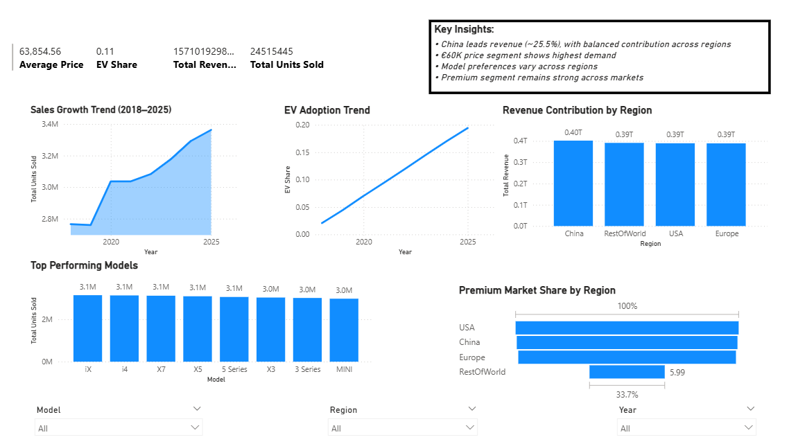
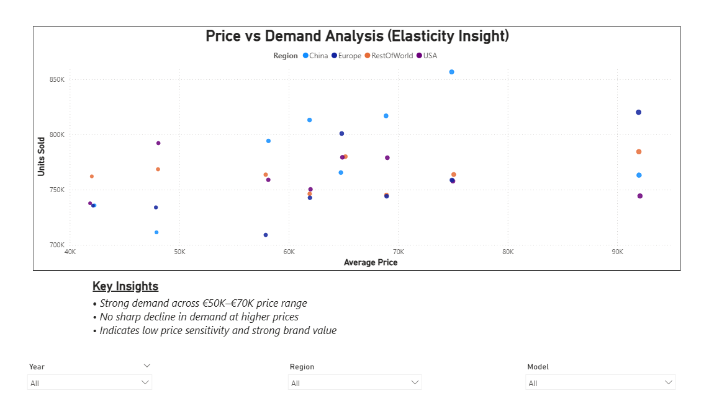

#  BMW Global Sales Analysis

##  Objective
To analyze BMW’s global sales performance across regions, models, pricing segments, and macroeconomic factors, and derive actionable business insights.

##  Dataset
The dataset contains monthly BMW sales data from 2018 to 2025, including:
- Region and Model
- Units Sold and Revenue
- Average Price (EUR)
- BEV (Electric Vehicle) Share
- Premium Segment Share
- GDP Growth and Fuel Price Index

##  Tools & Technologies
- SQL (Data Cleaning, Analysis, KPI Calculation)
- Power BI (Dashboard & Visualization)

##  Key Analysis Performed
- Regional sales and revenue distribution  
- Best-selling models by region  
- Price vs Demand (price segmentation analysis)  
- Premium vs non-premium market share  
- Impact of macroeconomic factors (GDP, fuel prices)  

##  Key Insights

- Revenue distribution is highly balanced across regions, with China contributing the largest share (~25.5%), indicating a well-diversified global presence  

- Model preferences vary significantly across regions, with electric models leading in China, while SUVs dominate in Europe and other markets  

- Demand peaks in the €60,000 price segment, suggesting it as the optimal pricing range balancing affordability and premium positioning  

- Premium segment vehicles consistently contribute a strong share of total sales, reinforcing BMW’s positioning in the luxury automotive market  

- Sales remain relatively stable despite fluctuations in GDP growth and fuel prices, indicating strong brand-driven demand and customer loyalty  

##  Dashboard

##  Conclusion
This analysis highlights the importance of regional strategy, optimal pricing, and strong brand positioning in driving BMW’s global performance. The findings suggest opportunities for targeted marketing, pricing optimization, and expansion of high-performing models in specific regions.

##  Project Highlights
- End-to-end data analysis using SQL  
- Advanced techniques: CTEs, window functions, price bucketing  
- Interactive Power BI dashboard with KPIs and filters  
- Business-focused insights derived from real data  

##  Future Scope
- Incorporate competitor data for market share analysis  
- Build predictive models for sales forecasting  
- Implement a star schema for scalable data modeling  

