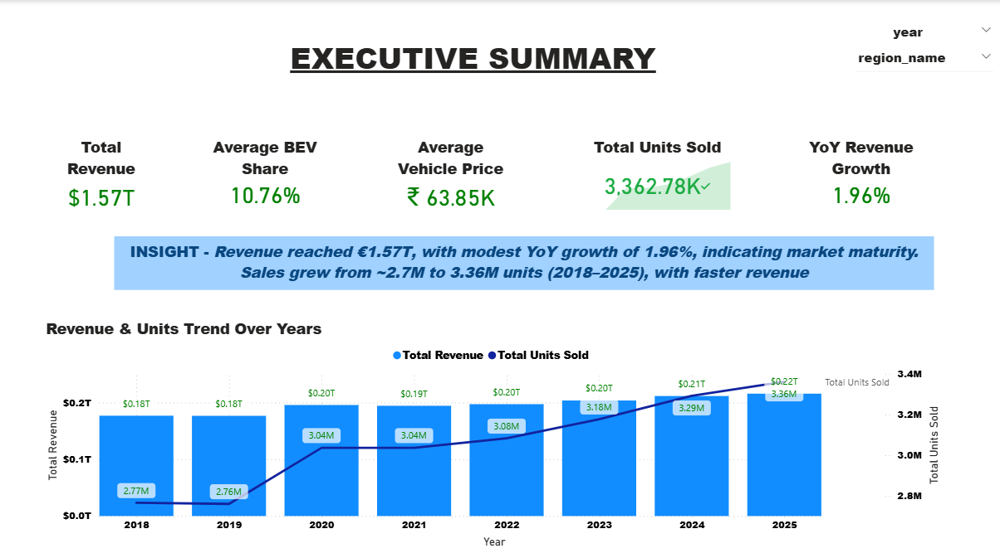
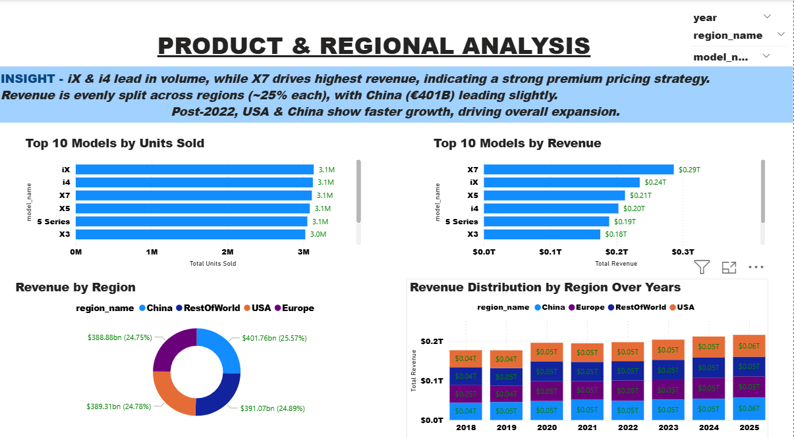
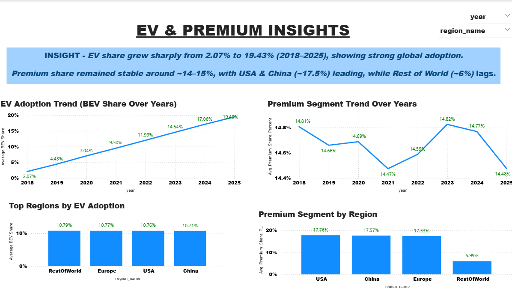

#  BMW Global Sales Analysis | SQL + Power BI

##  Project Overview

An end-to-end data analytics project analyzing **BMW’s global sales (2018–2025)** to uncover **revenue drivers, product strategy shifts, and EV adoption trends**.

 Built using **SQL (PostgreSQL) + Power BI**, this project delivers **actionable business insights** through data modeling, advanced queries, and interactive dashboards.

---

##  Dashboard Preview

### Executive Summary

*High-level KPIs and growth trends*


###  Product & Regional Analysis

*Revenue drivers across models and global markets*


###  EV & Premium Insights

*Shift toward electrification and premium positioning*



##  Key Business Insights

###  Revenue & Growth

* Generated **€1.57T revenue** with **1.96% YoY growth** → indicates **market maturity**
* Sales increased from **~2.7M → 3.36M units**, while revenue grew faster → **strong pricing power & premium mix**
 **Implication:** Future growth will likely depend on **expansion of EV segment and innovation**, rather than volume alone


###  Product Strategy

* **iX & i4 (EVs)** lead in unit sales → strong shift toward electrification
* **X7 generates highest revenue** despite lower volume → **high-margin premium positioning**
* Transition observed from **sedans → SUVs & EVs**
**Implication:** BMW should **scale EV production while maintaining premium models** to maximize both volume and margins


### Regional Performance

* Revenue evenly distributed (~25% each):

  * China: **€401B** | USA: **€391B** | Europe: **€388B**
* Highly diversified → **reduced regional dependency risk**
* **USA & China driving faster growth post-2022**
**Implication:** Growth strategy should **prioritize high-growth markets (USA, China)** while **expanding in underpenetrated regions**


### EV & Market Trends

* EV share surged from **2.07% → 19.43%** → rapid industry transition
* Premium segment stable at **~14–15%**
* **USA & China lead premium demand (~17.5%)**
* **Rest of World (~6%) = untapped opportunity**
**Implication:** EV segment will be the **primary driver of future growth**, while emerging markets present **expansion opportunities**


### Data Modeling (Star Schema)

Designed a scalable **star schema** for efficient analytics:

* **Fact Table:** `fact_sales`
* **Dimensions:** `dim_date`, `dim_region`, `dim_model`

 Enables optimized queries and real-world BI modeling practices.


## Technical Highlights

* Advanced SQL:

  * CTEs
  * Aggregations
  * Window functions
* Power BI:

  * Multi-page dashboard
  * KPI cards & time intelligence
  * Drillthrough functionality
* DAX:

  * YoY Growth
  * Averages & KPIs
  * **Dynamic insight generation (text + metrics)**


##  What Makes This Project Stand Out

✔️ Combines **data engineering + analytics + visualization**
✔️ Implements **star schema (industry-standard modeling)**
✔️ Includes **dynamic DAX insights (not just static dashboards)**
✔️ Focuses on **business decision-making, not just reporting**


##  Project Structure

```id="finalelite1"
bmw-global-sales-analysis/
│
├── README.md
├── data/
│   └── bmw_global_sales.csv
│
├── sql/
│   ├── 01_flat_table_analysis.sql
│   ├── 02_star_schema.sql
│   └── 03_advanced_analysis.sql
│
├── powerbi/
    ├── bmw_dashboard.pbix
    └── dashboard_screenshots/
        ├── page1.png
        ├── page2.png
        └── page3.png

```


##  How to Run

1. Execute SQL scripts in PostgreSQL
2. Load dataset into Power BI
3. Open `.pbix` file
4. Explore using slicers & drillthrough


##  Outcome

This project demonstrates:

* Strong **SQL + data modeling skills**
* Ability to build **interactive BI dashboards**
* Capability to generate **strategic business insights**


## Final Thought

This project reflects a real-world analytics workflow — transforming raw data into **decision-ready insights**, with a strong focus on **business impact and strategic thinking**.
